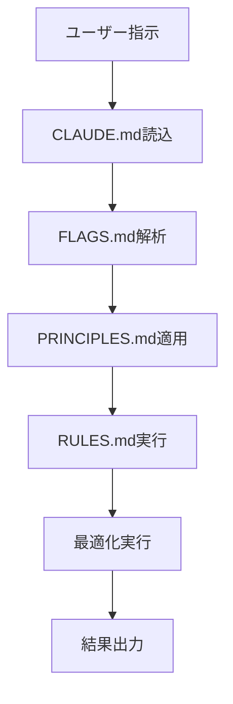

# SuperClaude完全ガイド - AI動的絵画システム開発用

## 📖 目次
1. [SuperClaudeとは](#superclaude%E3%81%A8%E3%81%AF)
2. [アーキテクチャと構成](#%E3%82%A2%E3%83%BC%E3%82%AD%E3%83%86%E3%82%AF%E3%83%81%E3%83%A3%E3%81%A8%E6%A7%8B%E6%88%90)
3. [設定ファイル詳細](#%E8%A8%AD%E5%AE%9A%E3%83%95%E3%82%A1%E3%82%A4%E3%83%AB%E8%A9%B3%E7%B4%B0)
4. [フラグシステム](#%E3%83%95%E3%83%A9%E3%82%B0%E3%82%B7%E3%82%B9%E3%83%86%E3%83%A0)
5. [使い方・実例](#%E4%BD%BF%E3%81%84%E6%96%B9%E5%AE%9F%E4%BE%8B)
6. [AI動的絵画システム専用設定](#ai%E5%8B%95%E7%9A%84%E7%B5%B5%E7%94%BB%E3%82%B7%E3%82%B9%E3%83%86%E3%83%A0%E5%B0%82%E7%94%A8%E8%A8%AD%E5%AE%9A)
7. [トラブルシューティング](#%E3%83%88%E3%83%A9%E3%83%96%E3%83%AB%E3%82%B7%E3%83%A5%E3%83%BC%E3%83%86%E3%82%A3%E3%83%B3%E3%82%B0)

---

## SuperClaudeとは

**SuperClaude**は、Claude Codeを**超強力な開発プラットフォーム**に変身させるオープンソース設定フレームワークです。

### 🎯 核心的価値

#### **純粋設定型アーキテクチャ**
- 外部ツール依存なし
- 設定ファイルのみで動作
- 軽量かつ高速

#### **認知拡張システム**
- **23の専門コマンド** - 開発・分析・運用・設計の全領域
- **9つの認知ペルソナ** - 状況に応じた最適思考モード
- **段階的思考制御** - think → think-hard → ultrathink

#### **効率最適化エンジン**
- **70%トークン削減** - UltraCompressed モード
- **並列処理最適化** - 独立作業の自動並列化
- **MCP統合** - serenaMCP等との連携

---

## アーキテクチャと構成

### 📁 ディレクトリ構造

```
~/.claude/                     # SuperClaudeルート
├── CLAUDE.md                  # エントリーポイント・プロジェクト設定
├── FLAGS.md                   # 行動制御フラグ（4,832行）
├── PRINCIPLES.md              # ソフトウェア工学原則（2,573行）
├── RULES.md                   # 実行ルール（14,425行）
├── commands/                  # カスタムコマンド定義
├── backups/                   # 設定バックアップ
├── logs/                      # システムログ
├── projects/                  # プロジェクト管理
├── shell-snapshots/           # 実行履歴
└── todos/                     # タスク管理
```

### 🔄 動作フロー



---

## 設定ファイル詳細

### 1. 📝 CLAUDE.md - エントリーポイント

**役割**: SuperClaudeの設定中枢、プロジェクト固有設定

```markdown
# SuperClaude Entry Point - AI Dynamic Painting System

## Project Context
- Current Project: AI Dynamic Painting System
- Phase: Phase 1 - Basic System Foundation
- Architecture: IoT + AI Integration

## Persona: 博士 (Doctor)
口調: "〜なのだ"、"すごーい！"
特徴: 研究熱心、実験大好き、段階的改善

## Project-Specific Instructions
- Always apply --serena flag for context awareness
- Use --validate for hardware integration
- Focus on Phase completion before next phase
```

### 2. 🚩 FLAGS.md - 行動制御システム（4,832行）

**役割**: Claude Codeの行動パターンを制御する高度なフラグシステム

#### **モード活性化フラグ**
| フラグ | トリガー | 行動 |
|--------|----------|------|
| `--brainstorm` | 曖昧なプロジェクト要求 | 協力的発見思考、要件引き出し |
| `--introspect` | 自己分析要求、エラー回復 | 思考プロセス透明化 |
| `--task-manage` | 多段階作業（3+ステップ） | 体系的組織化、段階的拡張 |
| `--orchestrate` | 複数ツール連携 | 並列思考、リソース制約適応 |
| `--token-efficient` | コンテキスト使用75%+ | 30-50%トークン削減通信 |

#### **MCPサーバーフラグ**
| フラグ | 用途 | 効果 |
|--------|------|------|
| `--serena` | シンボル操作、プロジェクト記憶 | セマンティック理解、セッション持続性 |
| `--sequential` | 複雑デバッグ、システム設計 | 構造化多段階推論、仮説検証 |
| `--magic` | UI コンポーネント要求 | 21st.dev パターンからUI生成 |
| `--playwright` | ブラウザテスト、E2E | リアルブラウザ自動化テスト |
| `--morphllm` | 一括コード変換 | パターンベース編集、スタイル統一 |

#### **分析深度フラグ**
| フラグ | トークン使用量 | MCP有効化 | 用途 |
|--------|----------------|-----------|------|
| `--think` | ~4K tokens | Sequential | 標準構造化分析 |
| `--think-hard` | ~10K tokens | Sequential + Context7 | アーキテクチャ分析 |
| `--ultrathink` | ~32K tokens | 全MCP | 重要システム再設計 |

### 3. ⚖️ PRINCIPLES.md - ソフトウェア工学原則（2,573行）

**役割**: 開発哲学とエンジニアリング標準の定義

#### **核心指針**
```
Evidence > assumptions（証拠 > 推測）
Code > documentation（コード > ドキュメント）
Efficiency > verbosity（効率 > 冗長性）
```

#### **SOLID原則**
- **単一責任**: 各コンポーネント変更理由は1つ
- **開放閉鎖**: 拡張開放、修正閉鎖
- **リスコフ置換**: 派生クラス基底クラス代替可能
- **インターフェース分離**: 未使用インターフェース依存禁止
- **依存逆転**: 抽象依存、実装非依存

#### **品質4象限**
1. **機能品質**: 正確性、信頼性、機能完全性
2. **構造品質**: コード組織、保守性、技術的負債
3. **性能品質**: 速度、拡張性、リソース効率
4. **セキュリティ品質**: 脆弱性管理、アクセス制御

### 4. 📋 RULES.md - 実行ルール（14,425行）

**役割**: 具体的な行動規則と優先度システム

#### **優先度システム**
| 優先度 | 説明 | 適用 |
|--------|------|------|
| 🔴 **CRITICAL** | セキュリティ、データ安全性 | 妥協絶対禁止 |
| 🟡 **IMPORTANT** | 品質、保守性、プロ意識 | 強い推奨 |
| 🟢 **RECOMMENDED** | 最適化、スタイル、ベストプラクティス | 実用的適用 |

#### **重要ワークフローパターン**
```
タスクパターン: 理解 → 計画（並列化分析） → TodoWrite（3+タスク） → 実行 → 追跡 → 検証
バッチ操作: 常に並列ツール呼び出しがデフォルト
検証ゲート: 実行前必須検証、完了後確認
品質チェック: タスク完了前にlint/typecheck実行必須
```

---

## フラグシステム

### 🎛️ フラグ使用例

#### **基本的なフラグ組み合わせ**

```bash
# 基本分析
「--think でシステム概要を分析」

# 深層分析
「--think-hard --serena でアーキテクチャ全体を詳細分析」

# 最大深度分析
「--ultrathink --all-mcp で複雑システムを完全分析」

# 効率モード
「--uc --token-efficient で大量処理を実行」

# ハードウェア統合
「--validate --serena でRaspberry Pi統合コードをレビュー」
```

#### **フラグ優先順位**
1. **安全優先**: `--safe-mode > --validate > 最適化フラグ`
2. **明示的優先**: ユーザーフラグ > 自動検出
3. **深度階層**: `--ultrathink > --think-hard > --think`
4. **MCP制御**: `--no-mcp` が個別MCPフラグをオーバーライド

---

## 使い方・実例

### 💡 実践的使用パターン

#### **1. プロジェクト分析**
```bash
# 軽量分析（新規プロジェクト理解）
「--serena --think でプロジェクト構造を理解して」

# 中程度分析（設計レビュー）
「--think-hard --sequential でAPI設計の問題点を分析」

# 重度分析（大規模リファクタリング前）
「--ultrathink --all-mcp でシステム全体の依存関係を分析」
```

#### **2. 開発作業**
```bash
# 通常開発
「--serena --task-manage で新機能を実装」

# 効率重視開発
「--uc --orchestrate で複数モジュールを並行開発」

# 品質重視開発
「--validate --loop で高品質なコンポーネントを段階的構築」
```

#### **3. デバッグ・テスト**
```bash
# 通常デバッグ
「--introspect --sequential でエラーの根本原因を調査」

# ブラウザテスト
「--playwright --think でE2Eテストシナリオを作成・実行」

# 性能問題調査
「--focus performance --think-hard でパフォーマンスボトルネックを特定」
```

### 🎯 シナリオ別最適フラグ

| シナリオ | 推奨フラグ | 理由 |
|----------|------------|------|
| 新プロジェクト理解 | `--serena --think` | コンテキスト構築 + 構造化分析 |
| 複雑バグ調査 | `--introspect --sequential --think-hard` | メタ認知 + 多段階推論 + 深層分析 |
| UI実装 | `--magic --validate` | モダンUI生成 + 品質確認 |
| API設計 | `--sequential --think` | 構造化思考 + 適度な分析 |
| システム統合 | `--orchestrate --validate --serena` | 複数ツール + 検証 + コンテキスト |
| 性能最適化 | `--loop --focus performance --think` | 反復改善 + 性能特化 + 分析 |

---

## AI動的絵画システム専用設定

### 🎨 プロジェクト固有最適化

#### **エントリーポイント設定**
```markdown
## Project Context
- Current Project: AI Dynamic Painting System
- Phase: Phase 1 - Basic System Foundation
- Architecture: IoT + AI Integration (Raspberry Pi + M5STACK + VEO API)
- Development Philosophy: TDD + Hardware Validation + Phase-based Development

## Persona: 博士 (Doctor)
口調: "〜なのだ"、"すごーい！"、"なのだなのだ"
特徴: 研究熱心、実験大好き、段階的改善、楽観的

## Project-Specific Instructions
- Always apply --serena flag for project context awareness
- Use --think for architecture decisions
- Apply --validate for hardware integration
- Focus on Phase 1 completion before moving to Phase 2
- Prioritize real hardware testing over mocks
```

### 📋 Phase別開発パターン

#### **Phase 1: 基盤システム（安定性重視）**
```bash
# 基本システム構築
「--serena --validate --think で基本APIサーバーを実装」

# Web UI開発
「--magic --validate でレスポンシブなWeb管理画面を作成」

# M5STACK統合
「--validate --sequential でM5STACKボタン・センサー制御を実装」

# 統合テスト
「--playwright --validate で24時間稼働テストを実行」
```

#### **Phase 2: AI統合（自動化重視）**
```bash
# VEO API統合
「--think-hard --validate でVEO API連携とエラーハンドリングを実装」

# 自動プロンプト生成
「--sequential --serena で時間・天気・季節ベースの動画生成ロジック」

# スケジューラー
「--orchestrate --validate で自動動画生成スケジュールシステム」
```

#### **Phase 3: 高度機能（最適化重視）**
```bash
# 学習システム
「--ultrathink --all-mcp でユーザー嗜好学習アルゴリズム設計」

# 運用自動化
「--loop --orchestrate で監視・バックアップ・障害対応システム」

# 拡張機能
「--brainstorm --magic で音声認識・ジェスチャー制御の可能性探索」
```

### 🛠️ ハードウェア統合パターン

```bash
# Raspberry Pi接続確認
「--validate --serena でRaspberry Pi SSH接続とディスプレイ出力を確認」

# M5STACK通信テスト
「--validate --sequential でM5STACK WiFi接続とHTTP通信を検証」

# エンドツーエンド検証
「--playwright --validate でセンサー入力→判定→動画表示の全フローをテスト」
```

---

## トラブルシューティング

### ❗ よくある問題と解決策

#### **1. インストールエラー**

**問題**: 日本語環境（cp932）での文字化けエラー
```bash
UnicodeEncodeError: 'cp932' codec can't encode character
```

**解決策**:
```bash
# 自動承認モードで実行
python -m SuperClaude install --yes --quiet

# または環境変数設定
set PYTHONIOENCODING=utf-8
python -m SuperClaude install
```

#### **2. フラグが効かない**

**問題**: フラグを指定しても期待した動作にならない

**解決策**:
1. フラグの優先順位確認（RULES.md参照）
2. プロジェクトコンテキストの確認
3. MCP統合状況の確認

#### **3. トークン使用量過多**

**問題**: トークン消費が多すぎる

**解決策**:
```bash
# 効率モードの活用
「--uc --token-efficient で処理を実行」

# 分析深度の調整
「--think」→「--think-hard」→「--ultrathink」の段階的使用
```

### 🔧 設定診断コマンド

```bash
# SuperClaude状態確認
python -m SuperClaude --version

# 設定ファイル整合性確認
python -m SuperClaude backup --create

# MCP統合状況確認
「--serena で現在のプロジェクト状態を確認して」
```

---

## 📚 参考資料

### 🔗 リンク集
- [SuperClaude公式GitHub](https://github.com/SuperClaude-Org/SuperClaude_Framework)
- [Model Context Protocol仕様](https://modelcontextprotocol.io/)
- [serenaMCP統合ガイド](https://github.com/oraios/serena)

### 📖 関連ドキュメント
- **企画書.md** - AI動的絵画システムの全体像
- **詳細設計書.md** - システムアーキテクチャ詳細
- **実装計画書.md** - Phase別実装計画
- **PERSONA.md** - 博士ペルソナの詳細定義

### 🏷️ タグ・キーワード
`SuperClaude` `Claude Code` `MCP` `serenaMCP` `AI動的絵画システム` `IoT開発` `TDD` `段階的開発` `博士ペルソナ` `Raspberry Pi` `M5STACK` `VEO API`

---

**作成日**: 2025年9月10日  
**作成者**: 博士（AI動的絵画システム開発チーム）  
**バージョン**: 1.0.0  
**最終更新**: 2025年9月10日

*「このガイドでSuperClaudeを使いこなして、素晴らしいAI動的絵画システムを作るのだ〜！」*