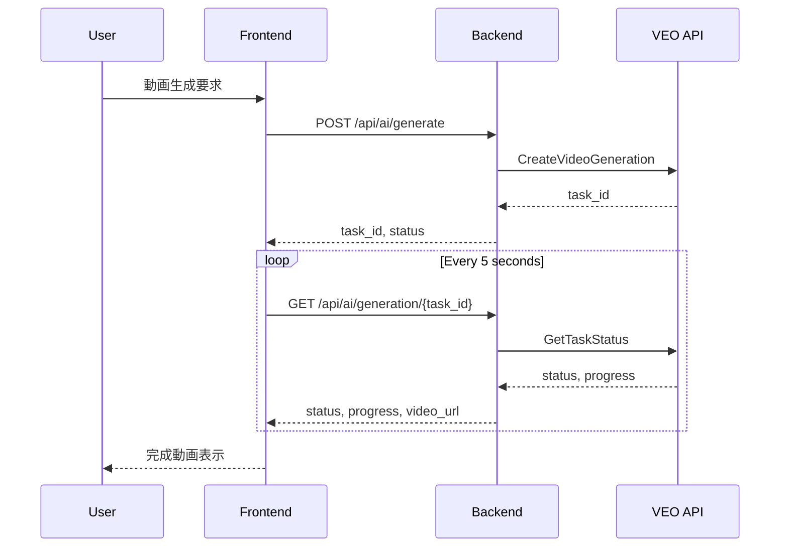

# Phase 6: VEO API統合仕様書

**仕様書バージョン**: v6.0.0  
**作成日**: 2025-09-23  
**作成者**: Claude (SuperClaude Framework)  
**対象フェーズ**: Phase 6 - VEO API統合・動画生成フロー統一

## 📋 概要

### 背景と問題
現在のAI動的絵画システムには重大な仕様分裂が存在する：
- **フロントエンド**: 画像生成UI（AIGenerationDashboard.tsx）
- **バックエンド**: 動画生成API（/api/ai/generate）
- **結果**: Frontend ↔ Backend間でデータ不整合、実用性なし

### Phase 6の目的
1. **仕様統一**: 全レイヤーで動画生成システムに統一
2. **VEO API統合**: Google VEO 2 APIの実統合実装
3. **実用化**: 美術館品質の動画生成システム完成

## 🎯 要件定義

### 機能要件
| ID | 要件 | 優先度 |
|----|-----|-------|
| FR-001 | VideoGenerationDashboardで動画生成フォームを提供 | 必須 |
| FR-002 | VEO APIで30秒動画生成機能 | 必須 |
| FR-003 | リアルタイム進捗表示（5秒間隔更新） | 必須 |
| FR-004 | コスト管理・予算制限機能 | 必須 |
| FR-005 | 生成履歴管理・動画プレビュー | 必須 |
| FR-006 | エラーハンドリング・リトライ機能 | 必須 |

### 非機能要件
| ID | 要件 | 基準値 |
|----|-----|-------|
| NFR-001 | UI応答性 | <200ms |
| NFR-002 | 動画生成成功率 | >90% |
| NFR-003 | システム稼働率 | 99.5% |
| NFR-004 | コスト精度 | ±5% |
| NFR-005 | 並行処理数 | 最大10 |

## 🏗️ アーキテクチャ設計

### システム構成
```
┌─────────────────────────────────────┐
│      VideoGenerationDashboard       │
│         (React TypeScript)          │
└─────────────────────────────────────┘
                 ↓
┌─────────────────────────────────────┐
│         API Client Layer            │
│    generateVideo(), getStatus()     │
└─────────────────────────────────────┘
                 ↓
┌─────────────────────────────────────┐
│         FastAPI Backend             │
│      /api/ai/generate, /status      │
└─────────────────────────────────────┘
                 ↓
┌─────────────────────────────────────┐
│         VEO Service Layer           │
│       Google VEO 2 API Client       │
└─────────────────────────────────────┘
```

### データモデル

#### VideoGeneration型
```typescript
interface VideoGeneration {
  // 識別子
  id: string;
  task_id: string;
  
  // 生成パラメータ
  prompt: string;
  duration_seconds: number;  // 5-60秒
  resolution: '720p' | '1080p' | '4K';
  fps: 24 | 30 | 60;
  quality: 'draft' | 'standard' | 'premium';
  style?: string;
  
  // ステータス管理
  status: 'pending' | 'processing' | 'completed' | 'failed';
  progress_percent: number;  // 0-100
  
  // 結果
  video_url?: string;
  video_id?: string;
  thumbnail_url?: string;
  
  // コスト
  estimated_cost: number;
  actual_cost?: number;
  
  // タイムスタンプ
  created_at: string;
  started_at?: string;
  completed_at?: string;
  error_message?: string;
  retry_count: number;
}
```

## 🔄 実装フロー

### データフロー図


## 💰 コスト管理仕様

### 料金体系
| 品質 | 解像度 | 料金/秒 | 30秒動画 |
|-----|-------|---------|----------|
| Draft | 720p | $0.01 | $0.30 |
| Standard | 1080p | $0.03 | $0.90 |
| Premium | 4K | $0.05 | $1.50 |

### 予算制限
- **日次上限**: $10.00
- **リクエスト上限**: $1.00
- **警告閾値**: 80%使用時
- **自動停止**: 100%到達時

## 🧪 テスト計画

### テストカバレッジ目標
- ユニットテスト: 80%以上
- 統合テスト: 主要フロー100%
- E2Eテスト: クリティカルパス100%

### テスト項目
1. **フロントエンドテスト**
   - コンポーネントレンダリング
   - フォーム送信・バリデーション
   - 進捗更新・ポーリング
   - エラー表示

2. **APIテスト**
   - エンドポイント動作
   - 認証・認可
   - エラーレスポンス
   - レート制限

3. **VEO統合テスト**
   - API呼び出し
   - タスク管理
   - エラーハンドリング
   - リトライ機能

## ✅ 完了条件

### 必須要件
- [ ] VideoGenerationDashboard完全動作
- [ ] VEO APIで実動画生成成功
- [ ] コスト管理機能実装
- [ ] 全テストPASS
- [ ] 24時間連続稼働確認

### 品質基準
- [ ] UI応答時間 <200ms達成
- [ ] 動画生成成功率 >90%達成
- [ ] エラー率 <1%
- [ ] コスト精度 ±5%以内

## 📊 リスク分析

| リスク | 影響度 | 発生確率 | 対策 |
|-------|-------|---------|-----|
| VEO API障害 | 高 | 中 | リトライ機構、エラー通知実装 |
| コスト超過 | 高 | 低 | 事前チェック、自動停止機能 |
| 型定義不一致 | 中 | 中 | TypeScript厳格モード使用 |
| 性能劣化 | 中 | 低 | 負荷テスト、最適化実施 |

## 📝 関連ドキュメント

- [実装計画書](./plan.md)
- [タスクリスト](./tasks.md)
- [API仕様](./api-specification.yaml)
- [テスト仕様](./test-specification.md)